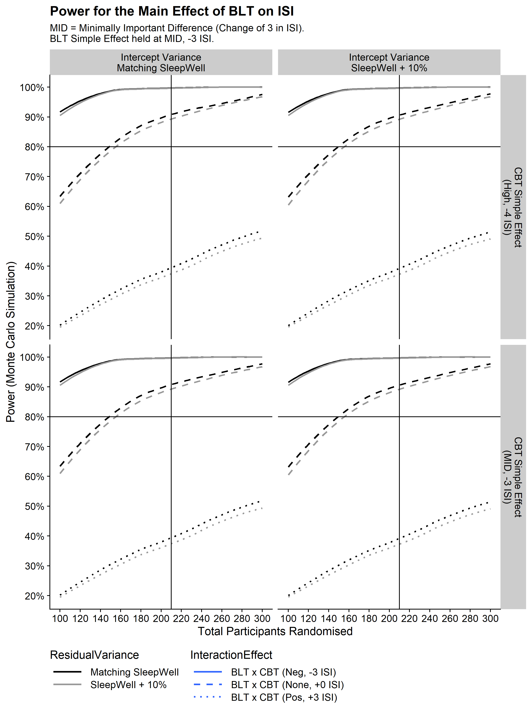
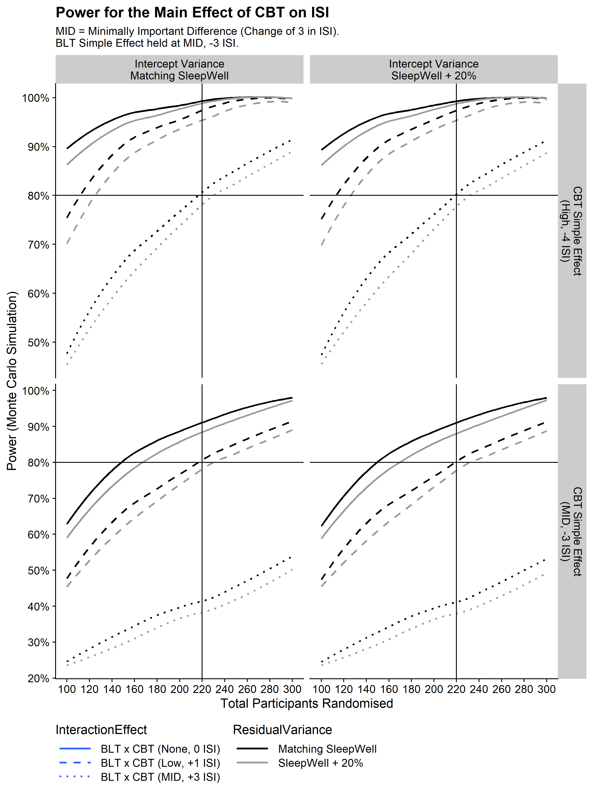
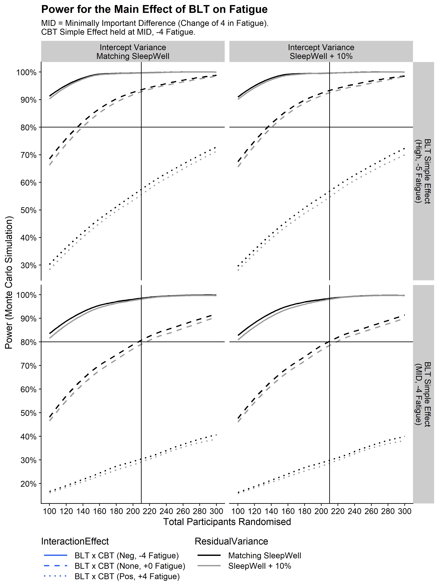
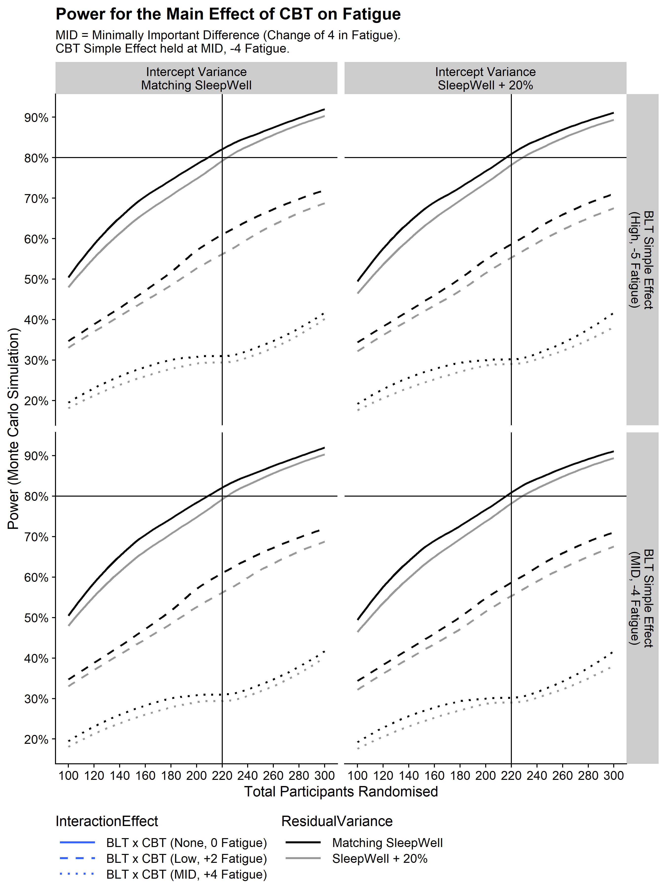
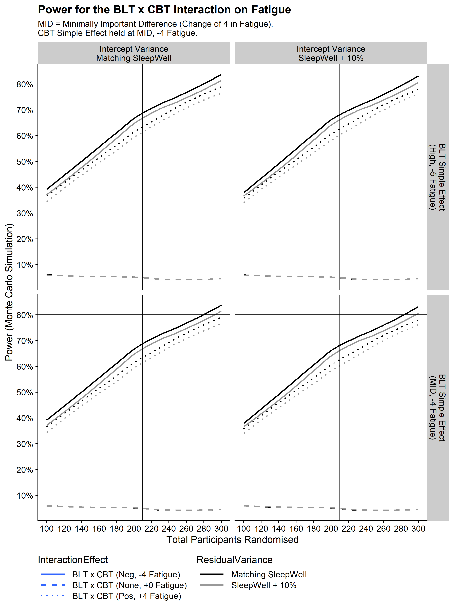

# SleepCarePlanning
Power Analysis and Statistical Analysis Code for SleepCare Trial

To see the power analysis for the trial, view the `sleepcare_power.R`
file. Results are shown in the following graphs.

